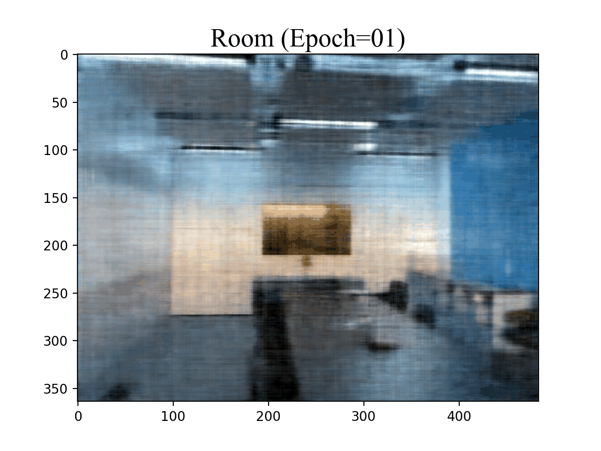
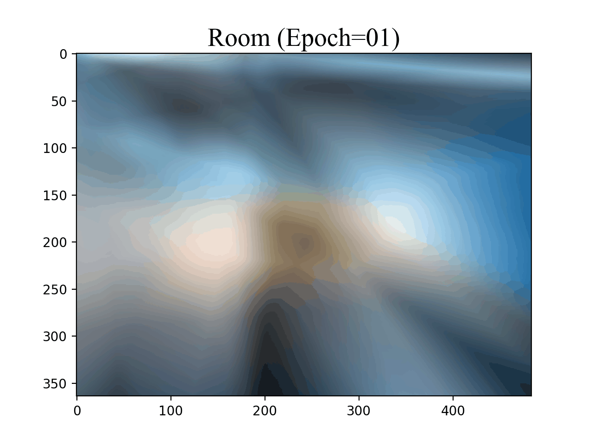

# NeRF_Verify

## Positional Encoding in NeRF

[](https://www.kaggle.com/zheruiqiu/pe-in-nerf)

### 模型训练
创建 conda 环境

```bash
cd Use_of_PE
conda env create -f environment.yml
```
运行代码
```bash
python PE_pl.py
```

### 实验结果
MLP with Positional Encoding | MLP without Positional Encoding
:-:|:-:
 | 